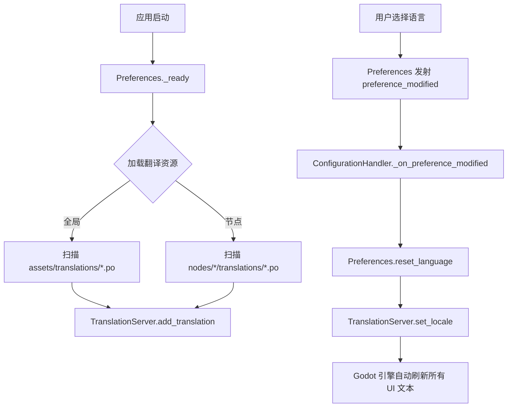

# Arrow 编辑器国际化实现调用链笔记

## 1. 初始化：加载翻译资源

**触发点**: 应用启动，`Preferences` 面板初始化。

*   文件: `scripts/editor/panels/preferences.gd`
*   函数: `_ready()` -> `refresh_language_options()`

**加载流程**:

1.  **加载全局翻译**:
    *   代码位置: `preferences.gd: refresh_language_options()`
    *   逻辑:
        *   读取 `Settings.UI_TRANSLATIONS_DIR` (即 `res://assets/translations/`)。
        *   遍历目录下的 `.po` 文件 (如 `zh_CN.po`, `en.po`)。
        *   `ResourceLoader.load(path)`: 加载翻译文件。
        *   `TranslationServer.add_translation(translation)`: 将翻译资源注册到 Godot 引擎的翻译服务器。

2.  **加载节点特定翻译**:
    *   代码位置: `scripts/core/node_types_handler.gd`
    *   函数: `load_node_types()` (由 `Main` 或 `Mind` 初始化时调用) -> `parse_node_type_folder()`
    *   逻辑:
        *   遍历 `res://nodes/` 下的每个节点目录。
        *   检查并加载 `translations/` 子目录下的文件。
        *   同样调用 `TranslationServer.add_translation(translation)` 注册节点特有的翻译。

## 2. 运行时：切换语言

**触发点**: 用户在“首选项”面板的语言下拉菜单中选择新语言。

**调用栈**:

1.  **用户交互**:
    *   `scripts/editor/panels/preferences.gd: _ready()`
    *   连接信号：`FIELDS.language.item_selected.connect(...)`

2.  **信号传递**:
    *   `preferences.gd: preprocess_and_emit_modification_signal()`
    *   获取选中的语言代码（如 "zh_CN"）。
    *   发射信号：`preference_modified("language", "zh_CN")`。

3.  **处理配置变更**:
    *   `scripts/core/configuration_handler.gd: _on_preference_modified("language", "zh_CN")`
    *   该函数识别到 `language` 字段的变更。
    *   调用 `Main.UI.PANELS.preferences.reset_language("zh_CN")`。

4.  **执行切换 (底层 API)**:
    *   `scripts/editor/panels/preferences.gd: reset_language(by_locale)`
    *   调用核心 API：**`TranslationServer.set_locale(by_locale)`**。
    *   **Godot 引擎行为**: 此时，所有设置了 `text` 属性的 UI 控件（Label, Button 等）如果使用了翻译键（如 "New"），会自动刷新显示为目标语言的文本（如 "新建"）。无需手动刷新每个控件。

## 3. 调用链图示

